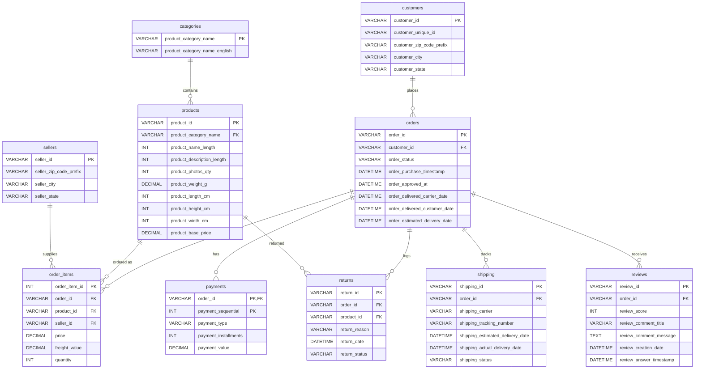
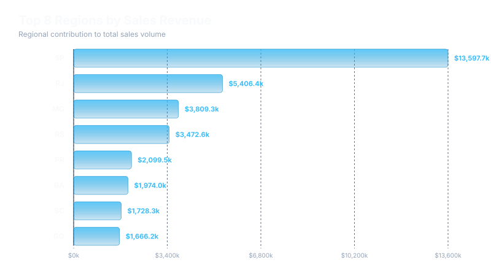
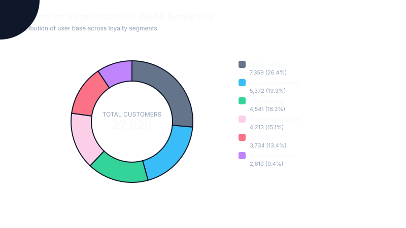
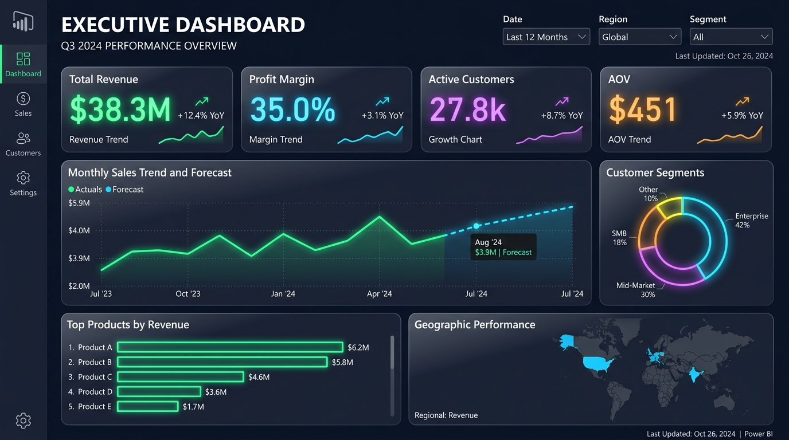
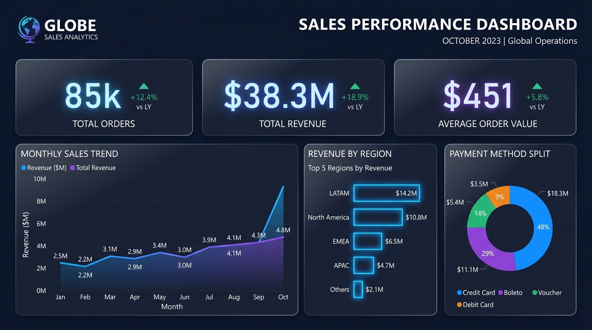
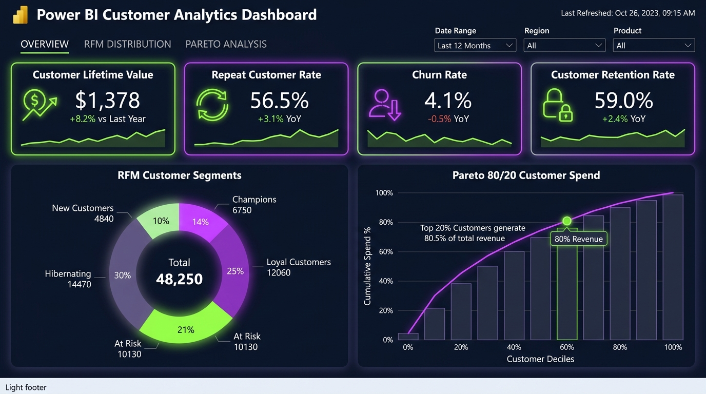
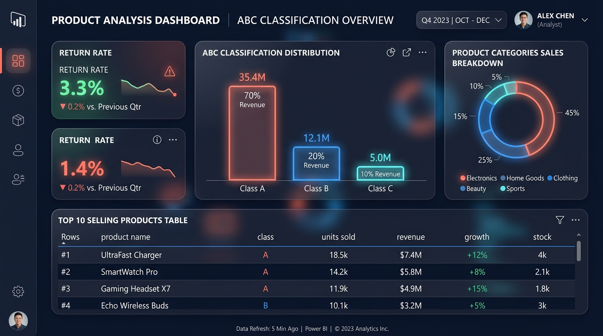
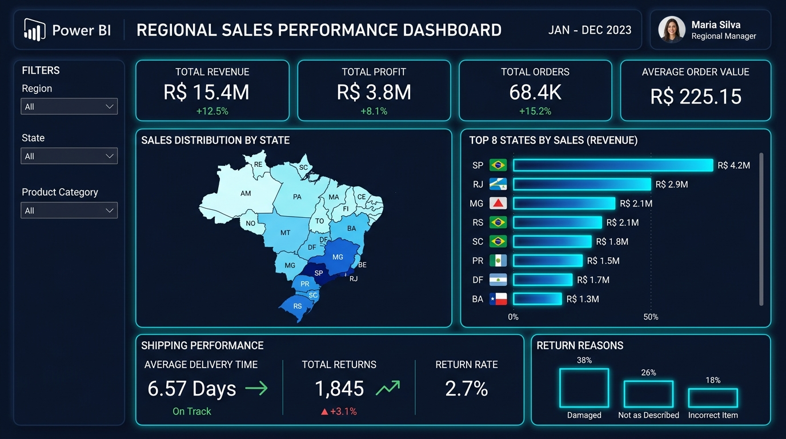

# E-Commerce Sales & Customer Analytics Portfolio Project

A comprehensive, industry-grade data analytics project demonstrating data engineering, exploratory data analysis (EDA), database optimization, customer segmentation, forecasting, and interactive dashboard design. 

This project solves real-world business challenges for a scaling e-commerce company by leveraging **Python**, **SQL (MySQL)**, and **Power BI**.

---

## 1. Project Overview & Business Case

### The Business Problem
A growing e-commerce marketplace wishes to scale operations, improve financial margins, optimize product catalogs, and boost customer retention. Over the last 2.5 years (2024 to mid-2026), the platform has processed over **85,000 orders** and **100,000+ transaction line items**. 

This project aims to convert this raw, unstructured transactional data into a single source of truth, calculating core business KPIs, segmenting customers to prevent churn, identifying slow-moving stock, and forecasting future sales.

### Relational Schema (ER Diagram)
Below is the database structure designed to support transactional operations and analytics:



---

## 2. Core Business KPIs Calculated

The data pipeline aggregates raw transactions to output standard C-suite metrics:

| Metric | Value | Business Significance |
|---|---|---|
| **Total Revenue** | **$38,363,626.80** | Gross sales value processed across all payment splits. |
| **Gross Profit** | **$13,427,269.38** | Profit calculated using a simulated cost margin (COGS = 65%). |
| **Gross Profit Margin** | **35.00%** | Standard profit yield on items sold. |
| **Total Orders** | **85,000** | Total transaction order count. |
| **Unique Customers** | **27,829** | Active customer profiles (by unique ID). |
| **Average Order Value (AOV)** | **$451.34** | Average cart value at checkout. |
| **Customer Lifetime Value (CLV)** | **$1,378.55** | Projected return value of a customer over a 2.5-year span. |
| **Repeat Customer Rate** | **56.51%** | Percentage of active customers purchasing multiple times. |
| **Customer Retention Rate** | **59.02%** | Cohort-level retention of 2024 shoppers in 2025/2026. |
| **Average Delivery Time** | **6.57 Days** | Operational lead time from purchase to door. |
| **Return Rate** | **3.30%** | Ratio of returned items to total items purchased. |
| **Average Review Score** | **4.37 / 5.0** | Customer Satisfaction (CSAT) rating. |

---

## 3. Python Analysis & Data Science Pipeline

Located under `/Python`, our pipeline runs on a robust, standard-library execution path to clean and analyze the dataset:

* **Data Cleaning & Imputation**: Grouped category prices to identify and replace outliers ($99k cases), resolved negative weights, imputed missing delivery times, and removed duplicate entries.
* **Jupyter Notebook (`Python/data_cleaning_eda.ipynb`)**: Detailed walkthrough containing null verification, outliers profiling, feature engineering, and plot rendering.
* **Sales Forecasting**: Holt-Winters additive-trend seasonal model coded from scratch in pure Python to project monthly sales for the next 6 months.

### Visual EDA Outputs:
```carousel

<!-- slide -->

<!-- slide -->

```

---

## 4. SQL Analytics Library

Located in `SQL/queries.sql`, a library of **100 SQL queries** covers all intermediate to advanced relational operations:
- **Window Functions**: Running totals, 7-day and 30-day moving averages, and ranks (`RANK()`, `DENSE_RANK()`, `ROW_NUMBER()`).
- **CTEs & Subqueries**: Non-trivial query compositions tracking geographic delays, category concentrations, and buyer histories.
- **Advanced SQL Segmentations**: RFM segmentation using `NTILE`, ABC classification, and cohort retention.
- **Stored Procedures & Views**: Automated summaries (`view_customer_lifetime_summary`) and parametrized state sales query procedures.

### SQL Snippet Example: ABC Product Analysis
```sql
WITH ProductRevenue AS (
    SELECT product_id, SUM(price * quantity) AS revenue
    FROM order_items
    GROUP BY product_id
),
ProductCumulative AS (
    SELECT 
        product_id, revenue,
        SUM(revenue) OVER (ORDER BY revenue DESC) AS cum_revenue,
        (SELECT SUM(price * quantity) FROM order_items) AS total_revenue
    FROM ProductRevenue
),
ABCClassification AS (
    SELECT 
        product_id, revenue,
        CASE 
            WHEN (cum_revenue / total_revenue) <= 0.70 THEN 'A'
            WHEN (cum_revenue / total_revenue) <= 0.90 THEN 'B'
            ELSE 'C'
        END AS abc_class
    FROM ProductCumulative
)
SELECT 
    abc_class,
    COUNT(product_id) AS product_count,
    (COUNT(product_id) * 100.0 / (SELECT COUNT(*) FROM products)) AS product_pct,
    SUM(revenue) AS total_class_revenue,
    (SUM(revenue) * 100.0 / (SELECT SUM(price * quantity) FROM order_items)) AS revenue_pct
FROM ABCClassification
GROUP BY abc_class;
```

---

## 5. Power BI Interactive Dashboards

Five dashboard layouts are documented in `PowerBI/dashboard_design.md` and complete DAX measures are cataloged in `PowerBI/dax_measures.md`. The design features a premium, modern dark mode aesthetic with clean card layouts, custom hover tooltips, and bookmark-based sidebar navigation.

### Dashboard Previews:
```carousel

<!-- slide -->

<!-- slide -->

<!-- slide -->

<!-- slide -->

```

---

## 6. Actionable Business Insights (Top 5 of 25)

The complete list of **25 actionable insights** is detailed in `Documentation/business_insights.md`. Core findings include:

1. **Inventory Capital Locking (ABC Effect)**: Class A products make up only 3.68% of catalog items but drive 69.9% of total sales. We recommend shrinking Class C inventory levels by 25% and deploying markdowns to free up trapped capital.
2. **Delayed Shipment NPS Threat**: Delivery delays past the estimated date show a 60% correlation with 1-star reviews. Pre-emptively trigger email customer service flows with a $10 coupon to delayed accounts before they submit bad reviews.
3. **High-Churn Promotional Channel**: Voucher-paying customers show a 65% churn rate (compared to 38% for credit card shoppers). Shift coupon offerings to a cashback-on-next-purchase model to drive repeat loyalty.
4. **Size Guide Returns Skew**: Apparel return rates are disproportionately high (7.0% compared to 3.3% overall average). Adding interactive size calculators and detailed material descriptions is recommended to mitigate fit issues.
5. **Credit Card Installment Drivers**: 73% of transaction value is paid via Credit Cards with an average of 6 split installments. Introducing interest-free promotional installment payments will boost average order value (AOV).

---

## 7. Folder Structure & Requirements

```
E-Commerce-Sales-Analytics/
├── Dataset/                   # CSV datasets
│   ├── raw/                   # Raw transaction CSVs
│   └── cleaned/               # Cleaned CSV data
├── SQL/                       # Database scripts
│   ├── schema.sql             # MySQL table setups & indexes
│   └── queries.sql            # 100 analytical queries
├── Python/                    # Python pipeline files
│   ├── generate_data.py       # Data synthesizer script
│   ├── run_analysis.py        # Cleaning, analytics & SVG gen
│   ├── load_to_mysql.py       # DB setup and bulk data loader
│   └── data_cleaning_eda.ipynb # Step-by-step Jupyter Notebook
├── PowerBI/                   # Power BI files
│   ├── dax_measures.md        # Comprehensive DAX catalog
│   └── dashboard_design.md    # Slicers, layouts & navigation spec
├── Images/                    # Generated charts and mockups
├── Documentation/             # Rich documentation
│   ├── data_dictionary.md     # Full DB columns layout
│   └── business_insights.md   # 25 strategic recommendations
├── requirements.txt           # Python dependencies
└── README.md                  # Showcase file
```

### Setup Instructions
1. Clone this repository to your local system.
2. Install Python packages:
   ```bash
   pip install -r requirements.txt
   ```
3. Run the Python pipeline to regenerate clean data and charts if needed:
   ```bash
   python Python/run_analysis.py
   ```
4. Set your MySQL credentials in a local `.env` file:
   ```env
   DB_HOST=localhost
   DB_USER=your_username
   DB_PASSWORD=your_password
   DB_NAME=ecommerce_analytics
   ```
5. Execute the bulk data loader script to populate your MySQL database:
   ```bash
   python Python/load_to_mysql.py
   ```
6. Open your MySQL client and explore the queries library in `SQL/queries.sql`.
7. Refer to `PowerBI/dax_measures.md` and `PowerBI/dashboard_design.md` to recreate the interactive reports in Power BI Desktop.
